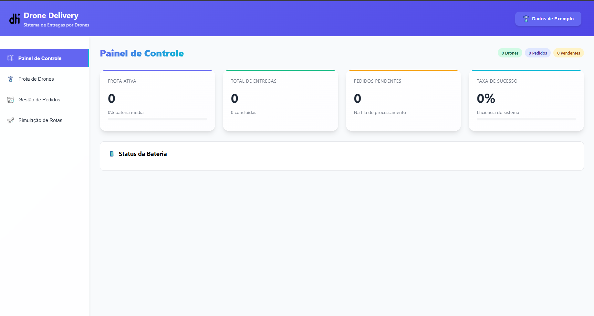

# 🚁 Drone Delivery System

Sistema inteligente de gerenciamento e simulação de entregas por drones com interface moderna e funcionalidades avançadas.




## ✨ Funcionalidades

- **🎯 Gestão Inteligente de Frotas**: Cadastro e monitoramento de drones com capacidades personalizadas
- **📦 Sistema de Pedidos Prioritários**: Entregas classificadas por urgência (alta, média, baixa)
- **🔋 Monitoramento de Bateria**: Controle em tempo real da autonomia dos drones
- **🔄 Simulação de Rotas**: Algoritmo otimizado para menor número de viagens
- **📊 Dashboard Interativo**: Visualização completa de métricas e desempenho
- **🎨 Interface Moderna**: Design responsivo com emojis animados

## 🚀 Tecnologias Utilizadas

- **Frontend**: React 18 + Vite
- **Estilização**: Styled Components
- **Ícones**: Emojis animados (GIF/PNG)
- **Build Tool**: Vite
- **Desenvolvimento**: JavaScript ES6+

🎮 Como Usar
Adicione Drones: Configure a frota com capacidade e alcance

Cadastre Pedidos: Defina localização, peso e prioridade

Simule Entregas: Execute a otimização de rotas

Monitore Resultados: Acompanhe métricas e desempenho

👨‍💻 Autor
Matheus Braga - https://github.com/MathBragaDev

🙋‍♂️ Suporte
Para dúvidas ou sugestões, abra uma issue no GitHub.

Desenvolvido com ❤️ para o processo seletivo de estágio

## 📦 Instalação

```bash
# Clone o repositório
git clone https://github.com/MathBragaDev/drCaseEstagioDTI

# Entre no diretório
cd drone-delivery-system

# Instale as dependências
npm install

# Execute em modo desenvolvimento
npm run dev
